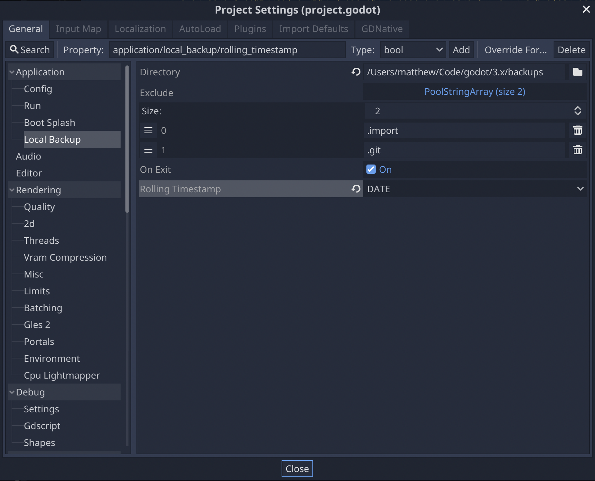
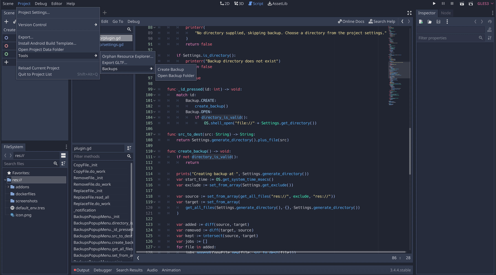

# Godot Local Backup

Create backups of you project in a local directory

## Project Settings

### Directory

The directory to create backups in. The project name will be used for the backup folder's prefix.

### Exclude

File names to exclude. Currently supports exact match only.

### On Exit

Creates backups when exiting the editor.

### Rolling Timestamp

Adds a timestamp to the backup name. This allows historical backups to be created.

* *NONE* - Adds no extra timestamp which would only ever create 1 backup.
* *DATE* - Appends *YYYYMMDD* to the backup name allowing snapshots to be generated daily.
* *EPOCH* - Appends the number of milliseconds that have passed since EPOCH allowing new backups generate on each exit.

## Tool Menu

### Create Backup

Create a backup immediately.

### Open Backup Folder

Opens the backup folder using the computer's built in file explorer.

## Suggestions

These are just some ways you should backup your game.

### Hard Drive

Plug an external hard drive and update the plugin settings to create backups there.

### Network Drive

If you have other PCs on your network you could setup a network drive and create your backups remotely.

### Cloud

Many cloud storage backup a folder on your PC. Adjust the plugin settings to use that directory.
