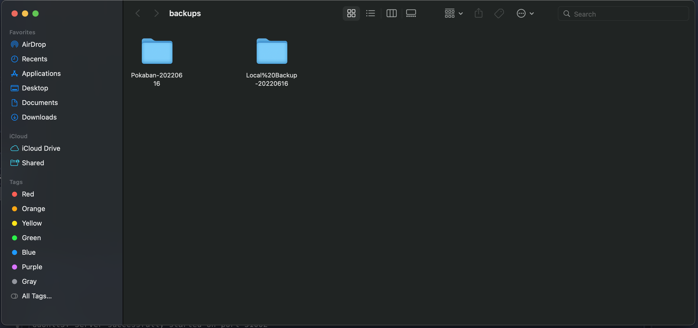

# Godot Local Backup

Create backups of you project in a local directory

*Disclaimer: This plugin is in no way meant to replace proper version control systems such as Git. This addon should be used to supliment existing backup solutions and give proper coverage in an extreme outage. It gives you one more source to fallback if you are not able to recover your project your primary sources.*

## Project Settings

### Directory

The directory to create backups in. The project name will be used for the backup folder's prefix.

### Exclude

File names to exclude. Currently supports exact match only.

### On Exit

Creates backups when exiting the editor.

### Rolling Timestamp

Adds a timestamp to the backup name. This allows historical backups to be created.

* `NONE` - Adds no extra timestamp which would only ever create 1 backup.
* `DATE` - Appends *YYYYMMDD* to the backup name allowing snapshots to be generated daily.
* `EPOCH` - Appends the number of milliseconds that have passed since EPOCH which will generate a unique backup each time.

### Max Threads

The backups are created using threads. Using `-1` will use all processors available to do the backup quickly. Using `0` or `1` will avoid creating entirely.

## Tool Menu

### Create Backup

Create a backup immediately.

### Open Backup Folder

Opens the backup folder using the computer's built in file explorer.

## Example

## Suggestions

These are just some ways you should backup your game using this plugin.

### Hard Drive

Plug an external hard drive and update the plugin settings to create backups there.

### Network Drive

If you have other PCs on your network you could setup a network drive and create your backups remotely.

### Cloud

Many cloud storage backup a folder on your PC. Adjust the plugin settings to use that directory.
